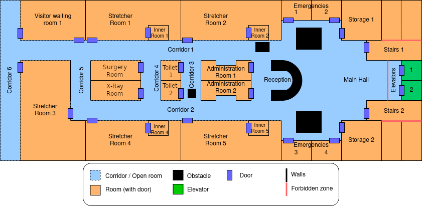

# merlin2-hospital-patrolling

La practica está enfocada al desarrollo de comportamientos simples con una arquitectura cognitiva para ROS 2. Para ello, se va a emplear el simulador de un robot móvil y la arquitectura cognitiva MERLIN2 [[1]](#1) que se basa en YASMIN [[2]](#2) y en KANT [[3]](#3).

## Introducción

Los objetivos planteados para esta práctica son:

- Familiarizarse con los componentes de una arquitecturas cognitiva.
- Comprender el diseño de una arquitectura cognitiva.
- Comprender cómo se han integrado los diferentes componentes de la arquitectura.
- Aprender a desarrollar comportamientos con arquitecturas cognitivas.

## Requisitos

Es necesario disponer de docker y rocker para ejecutar un contenedor con la arquitectura MERLIN2:

- [Docker](https://www.docker.com/)
- [Rocker](https://github.com/osrf/rocker)
- [MERLIN2 Docker Container](https://hub.docker.com/repository/docker/mgons/merlin2/general)
- [merlin2_docker](https://github.com/MERLIN2-ARCH/merlin2_docker)

Dentro del contenedor están disponibles los siguientes elementos:

- [MERLIN2](https://github.com/MERLIN2-ARCH/merlin2)
- [ros2_rb1](https://github.com/mgonzs13/ros2_rb1)
- [ros2_rb1_sandbox](https://github.com/mgonzs13/ros2_rb1_sandbox)

## Práctica

Para llevar a cabo la práctica se va a utilizar el robot RB1 y el mundo del hospital del AWS Robomaker que se presenta en la siguiente figura y en la figura posterior se presenta el mapa del hospital.




Para lanzar el mundo del hospital se utiliza el siguiente comando:

```shell
$ ros2 launch rb1_sandbox hospital.launch.py
```

La práctica consiste en realizar la misión de **patrullar las Stretcher Rooms**, es decir, el robot RB1 tiene que **navegar hasta las cinco Stretched Rooms**. En cada una de ellas tiene que **girar sobre si mismo y avisar de que ha terminado de patrullar esa habitación**. Para realizar las misiones es necesario implementar al menos un nodo de misión en la Mission Layer, las acciones necesarias de la Executive Layer, definir el dominio y el problema PDDL inicial y configurar los sistemas de la Reactive Layer.

## Referencias

<a id="1">[1]</a>
González-Santmarta, M. Á., Rodríguez-Lera, F. J., Fernández-Llamas, C., & Matellán-Olivera, V. (2023). Merlin2: Machined ros 2 planing. Software Impacts, 15, 100477.

<a id="2">[2]</a>
González-Santamarta, M. Á., Rodríguez-Lera, F. J., Matellán-Olivera, V., & Fernández-Llamas, C. (2022, November). YASMIN: Yet another state machine. In Iberian Robotics conference (pp. 528-539). Cham: Springer International Publishing.

<a id="3">[3]</a>
González-Santamarta, M. Á., Rodríguez-Lera, F. J., Martín, F., Fernández, C., & Matellán, V. (2022, May). KANT: A tool for grounding and knowledge management. In International Work-Conference on the Interplay Between Natural and Artificial Computation (pp. 452-461). Cham: Springer International Publishing.
